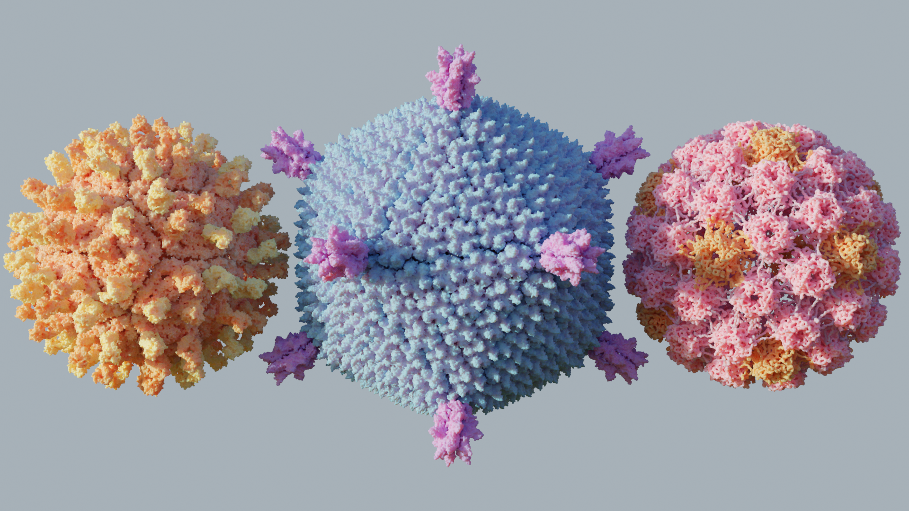

# Machine Learning for Proteins Starter Kit

  

  A curated collection of machine learning tools for proteins

## Contents

- [Getting Started](#getting-started)
- [Data Sources](#data-sources)
- [Key Tools](#key-tools)
  - [Structure Prediction](#1-structure-prediction)
  - [Interaction Modeling](#2-interaction-modeling)
  - [Sequence Design](#3-sequence-design)
  - [Binder Design](#4-binder-design)
  - [Generative Models](#5-generative-models)
  - [Language Models](#6-language-models)
  - [Benchmarks](#7-benchmarks)
  - [Utility Tools](#8-utility-tools)
- [Additional Resources](#additional-resources)

## Getting Started

[PyTorch Lightning + Hydra.](https://github.com/ashleve/lightning-hydra-template) A very user-friendly template for ML experimentation

## Data Sources

| Resource                                  | Description                                      |
| ----------------------------------------- | ------------------------------------------------ |
| [Protein Data Bank (PDB)](https://www.rcsb.org/) | Primary repository for protein structures           |
| [UniProt](https://www.uniprot.org/)         | Comprehensive protein sequence database            |
| [AlphaFold DB](https://alphafold.ebi.ac.uk/)   | Predicted protein structures                        |
| [CATH](https://www.cathdb.info/) / [TED](https://ted.cathdb.info/) | Protein domain classification                    |

## Key Tools

### 1. Structure Prediction

| Tool                               | Description                                      | Paper                                                                                             | Code                                                                                  | Other Resources                                           |
| ---------------------------------- | ------------------------------------------------ | ------------------------------------------------------------------------------------------------- | ------------------------------------------------------------------------------------- | --------------------------------------------------------- |
| **AlphaFold2 / ColabFold**         | State-of-the-art structure prediction            | [Paper](https://www.nature.com/articles/s41586-021-03819-2)                                       | [Code](https://github.com/google-deepmind/alphafold)                                 | [Colab](https://colab.research.google.com/github/sokrypton/ColabFold/blob/main/AlphaFold2.ipynb) |
| **ESMFold**                        | Fast, single-sequence prediction                 | [Paper](https://www.science.org/doi/10.1126/science.ade2574)                                    | [Code](https://github.com/facebookresearch/esm)                                        | [Server](https://esmatlas.com/resources?action=fold)    |
| **RoseTTAFold/RoseTTAFoldAllAtom** | Accurate structure prediction methods             | [Paper (RF)](https://www.science.org/doi/10.1126/science.abj8754)   [Paper (RF-AA)](https://www.science.org/doi/10.1126/science.adl2528) | [Code (RF)](https://github.com/RosettaCommons/RoseTTAFold)   [Code (RF-AA)](https://github.com/baker-laboratory/RoseTTAFold-All-Atom) |                                                           |

### 2. Interaction Modeling

| Tool          | Description                               | Paper                                                                  | Code                                                              |
| ------------- | ----------------------------------------- | ---------------------------------------------------------------------- | ----------------------------------------------------------------- |
| **AlphaFold3** | Accurate biomolecular interaction modelling                                          | [Paper](https://doi.org/10.1038/s41586-024-07487-w)                    | [Code](https://github.com/google-deepmind/alphafold3)              |
| **Boltz-1**   | Open-source reproduction of AF3                                           | [Paper](https://doi.org/10.1101/2024.11.19.624167)                     | [Code](https://github.com/jwohlwend/boltz)                        |
| **Chai-1**    |                                           | [Report](https://www.chaidiscovery.com/blog/introducing-chai-1)        | [Code](https://github.com/chaidiscovery/chai-lab)                  |

**Docking Tools:**

| Tool           | Description                                           | Paper                                                                     | Code                                                                 |
| -------------- | ----------------------------------------------------- | ------------------------------------------------------------------------- | -------------------------------------------------------------------- |
| **DiffDock-L** | Diffusion model for protein-ligand docking            | [Paper](https://arxiv.org/abs/2402.18396)                                | [Code](https://github.com/gcorso/DiffDock)                           |
| **DiffMaSIF**  | Surface-based protein-protein docking with diffusion models | [Paper](https://www.mlsb.io/papers_2023/DiffMaSIF_Surface-based_Protein-Protein_Docking_with_Diffusion_Models.pdf) |                                                                      |
| **FlowDock**   | Flow-based protein-ligand docking                     | [Paper](https://arxiv.org/abs/2412.10966)                                | [Code](https://github.com/BioinfoMachineLearning/FlowDock)            |

### 3. Sequence Design

| Tool           | Description                             | Paper                                                                     | Code                                                                  | Other Resources |
| -------------- | --------------------------------------- | ------------------------------------------------------------------------- | --------------------------------------------------------------------- | --------------- |
| **ProteinMPNN** | Backbone sequence design                | [Paper](https://www.science.org/doi/10.1126/science.add2187)               | [Code](https://github.com/dauparas/ProteinMPNN)                       |                 |
| **LigandMPNN**  | Ligand-aware sequence design            | [Paper](https://www.biorxiv.org/content/10.1101/2023.12.22.573103v1)      | [Code](https://github.com/dauparas/LigandMPNN)                        |                 |
| **ESM-IF1**    | Language model-based inverse folding   | [Paper](https://www.biorxiv.org/content/10.1101/2022.04.10.487779v2)      | [Code](https://github.com/facebookresearch/esm)                       | [Colab](https://colab.research.google.com/github/facebookresearch/esm/blob/main/examples/inverse_folding/notebook.ipynb)         |

### 4. Binder Design

| Tool        | Description   | Paper                                                                  | Code                                                               |
| ----------- | ------------ | ---------------------------------------------------------------------- | ------------------------------------------------------------------ |
| **Bindcraft** | Binder design through AF2 backpropagation | [Paper](https://www.biorxiv.org/content/10.1101/2024.09.30.615802)     | [Code](https://github.com/martinpacesa/BindCraft)                  |
| **EvoBind**  | Sequence-based peptide binder design | [Paper](https://www.biorxiv.org/content/10.1101/2024.06.20.599739v2)     | [Code](https://github.com/patrickbryant1/EvoBind)                 |

### 5. Generative Models

| Tool | Description | Paper | Code |
| ---- | ----------- | ----- | ---- |
| **RFDiffusion/AllAtom** | All-atom diffusion model for precise protein structure generation | [Paper](https://www.nature.com/articles/s41586-023-06415-8) | [Code](https://github.com/RosettaCommons/RFdiffusion) |
| **Protpardelle** | Designs backbone, sequence, and sidechains via diffusion | [Paper](https://www.pnas.org/doi/10.1073/pnas.2311500121) | [Code](https://github.com/ProteinDesignLab/protpardelle) |
| **Chroma** | Programmable diffusion model for constrained protein design | [Paper](https://www.nature.com/articles/s41586-023-06728-8) | [Code](https://github.com/generatebio/chroma) |
| **Framediff** | SE(3)-equivariant diffusion model for backbone generation | [Paper](https://arxiv.org/abs/2302.02277) | [Code](https://github.com/jasonkyuyim/se3_diffusion) |
| **Genie** | Asymmetric diffusion model for diverse protein backbones | [Paper](https://arxiv.org/abs/2301.12485) | [Code](https://github.com/aqlaboratory/genie) |
| **FoldFlow** | Flow-matching model for protein fold generation | [Paper](https://arxiv.org/abs/2310.02391) | [Code](https://github.com/DreamFold/FoldFlow) |
| **FrameFlow** | Fast SE(3) flow-based backbone generation | [Paper](https://arxiv.org/abs/2310.05297) | [Code](https://github.com/microsoft/protein-frame-flow) |
| **Multiflow** | Multimodal flow model for protein structure and sequence co-design | [Paper](https://arxiv.org/abs/2402.04997) | [Code](https://github.com/jasonkyuyim/multiflow) |
| **PLAID** | Guided diffusion model for flexible protein structure generation | [Paper](https://www.biorxiv.org/content/10.1101/2024.12.02.626353v1) | [Code](https://github.com/amyxlu/plaid) |

### 6. Language Models

| Tool          | Description                                           | Paper                                                                                                | Code                                                                   |
| ------------- | ----------------------------------------------------- | ---------------------------------------------------------------------------------------------------- | ---------------------------------------------------------------------- |
| **ESM-2**     | Masked language modelling on protein sequences         | [Paper](https://www.science.org/doi/10.1126/science.ade2574)                                         | [Code](https://github.com/facebookresearch/esm)                         |
| **ESM-3**     | Multimodal generative language model                  | [Paper](https://www.biorxiv.org/content/10.1101/2024.07.01.600583v2)                                | [Code](https://github.com/evolutionaryscale/esm)                        |
| **ProtGPT2**  | Autoregressive protein language model (pLM)           | [Paper](https://doi.org/10.1038/s41467-022-32007-7)                                                 | [Code](https://huggingface.co/nferruz/ProtGPT2)                        |
| **ProtT5**    | Autoencoder-based pLM                                 | [Paper](https://pubmed.ncbi.nlm.nih.gov/34232869/)                                                  | [Code](https://github.com/agemagician/ProtTrans)                        |
| **ProstT5**   | Structure-aware pLM using 3Di tokens                  | [Paper](https://www.biorxiv.org/content/10.1101/2023.07.23.550085v2)                                | [Code](https://github.com/mheinzinger/ProstT5)                         |
| **SaProt**    | Structure-aware pLM using 3Di tokens                  | [Paper](https://www.biorxiv.org/content/10.1101/2023.10.01.560349v5)                                | [Code](https://github.com/westlake-repl/SaProt)                         |
| **PoET**      | Autoregressive-based pLM                              | [Paper](https://arxiv.org/abs/2306.06156)                                                           | [Code](https://github.com/OpenProteinAI/PoET)                           |
| **ZymCTRL**   | Conditional language model for enzyme design          | [Paper](https://www.mlsb.io/papers_2022/ZymCTRL_a_conditional_language_model_for_the_controllable_generation_of_artificial_enzymes.pdf) | [Code](https://huggingface.co/AI4PD/ZymCTRL)                           |
| **DPO_pLM**   | Direct Preference Optimization for Protein LMs        | [Paper](https://arxiv.org/abs/2412.12979)                                                           | [Code](https://github.com/AI4PDLab/DPO_pLM)                            |

### 7. Benchmarks

| Tool              | Description                        | Paper                                                                                                | Code                                                                       | Website                                    |
| ----------------- | ---------------------------------- | ---------------------------------------------------------------------------------------------------- | -------------------------------------------------------------------------- | ------------------------------------------ |
| **ProteinGym**    | Protein fitness evaluation suite     | [Paper](https://papers.nips.cc/paper_files/paper/2023/file/cac723e5ff29f65e3fcbb0739ae91bee-Paper-Datasets_and_Benchmarks.pdf) | [Code](https://github.com/OATML-Markslab/ProteinGym)                       | [Website](https://proteingym.org/)          |
| **ProteinWorkshop** | Benchmark suite for representation learning | [Paper](https://openreview.net/forum?id=sTYuRVrdK3)                                                | [Code](https://github.com/a-r-j/ProteinWorkshop)                            | [Website](https://proteins.sh/)             |
| **Pinder**       | Protein-protein interaction benchmark| [Paper](https://www.biorxiv.org/content/10.1101/2024.07.17.603980v4)                                 | [Code](https://github.com/pinder-org/pinder)                               | [Website](https://www.pinder.sh/)           |
| **Plinder**      | Protein-ligand interaction benchmark | [Paper](https://www.biorxiv.org/content/10.1101/2024.07.17.603955v3)                                 | [Code](https://console.cloud.google.com/storage/browser/plinder)            | [Website](https://www.plinder.sh/)          |

### 8. Utility Tools

| Tool         | Description                   | Paper                                                                  | Code                                                              |  Server                             |
| ------------ | ----------------------------- | ---------------------------------------------------------------------- | ----------------------------------------------------------------- | -------------------------------------------- |
| **FoldSeek**  | Fast structure search         | [Paper](https://www.nature.com/articles/s41587-023-01773-0)             | [Code](https://github.com/steineggerlab/foldseek)                 | [Server](https://search.foldseek.com/search) |
| **MMseqs2**   | Sequence search and clustering | [Paper](https://www.nature.com/articles/nbt.3988)                       | [Code](https://github.com/soedinglab/MMseqs2)                      | [Server](https://seqsearch.west.k8s.rcsb.org/search) |
| **FoldMason** | Structure alignment at scale  | [Paper](https://www.biorxiv.org/content/10.1101/2024.08.01.606130v3)     | [Code](https://github.com/steineggerlab/foldmason)                | [Server](https://foldmason.com/)           |

## Additional Resources

- [DL4Proteins-notebooks](https://github.com/Graylab/DL4Proteins-notebooks) - Notebooks for protein ML
- [biolists](https://github.com/biolists) - Curated resource lists
- [Machine-learning-for-proteins](https://github.com/yangkky/Machine-learning-for-proteins) - Protein ML papers
- [Adaptyv Bio Tools List](https://design.adaptyvbio.com/tools) - Bioinformatics tools
- [MolecularNodes](https://bradyajohnston.github.io/MolecularNodes/) - Molecular visualization library
- [Molstar](https://molstar.org/) - Browser-based molecular visualization

---
